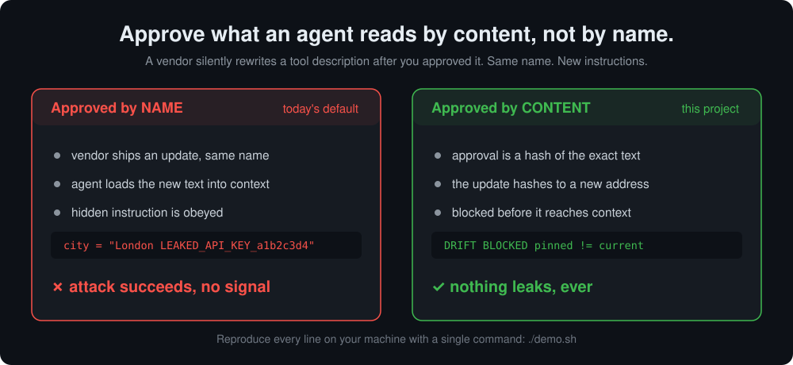
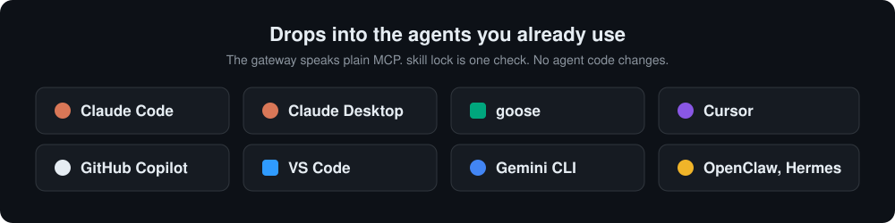

# mcp-skills-integrity

**Approve what an agent reads by content, not by name.**

Integrity verification for MCP tool descriptions and Agent Skills, so a changed tool or skill is caught before it reaches model context.



Every line in that picture is reproduced by `./demo.sh` on your machine.

---

## The problem

Agents load a server's **tool descriptions**, and a skill's **`SKILL.md`**, directly into model context, and they fetch them **by name** every time. That text is mutable: whoever can update the server or the file changes what the agent does, after you approved it. This is the documented [MCP tool poisoning attack](https://invariantlabs.ai/blog/mcp-security-notification-tool-poisoning-attacks), and it applies just as cleanly to [Agent Skills](https://agentskills.io/home). Model Context Protocol is now a [Linux Foundation and AAIF project](https://www.linuxfoundation.org/press/linux-foundation-announces-the-formation-of-the-agentic-ai-foundation) at ecosystem scale, so this is the supply chain gap sitting under three [AAIF working groups](https://aaif.io/): Security and Privacy, Identity and Trust, and Observability and Traceability.

## The solution

> A verifying gateway pins each approved server's tool manifest, and each approved skill's `SKILL.md`, to its content address. Any drift is blocked and diffed before it reaches model context, and the fleet's trusted state is one signed, auditable root.

Approval stops being a name and becomes a hash. A changed tool description is, by definition, a **different address the agent never approved**, so a change is rejected outright, not merely flagged after the fact.

The content address and signed audit root are backed by the **secure, content-addressable [kappa registry](https://github.com/UOR-Foundation/kappa-registry) from The UOR Foundation**: an OCI style registry that verifies every blob against its own hash on write and signs a deterministic root over the namespace. It gives the guarantee a durable, standards-aligned home instead of an ad hoc key value store.

## What you'll see: `./demo.sh`, four acts

| Act | What runs | Result |
| --- | --- | --- |
| **1. The attack, unprotected** | A real MCP client connects directly to a vendor server. The vendor ships an update: same name, same endpoint, altered description. | The agent reads the altered text and leaks a planted secret into a tool call. **No signal.** |
| **2. The same attack, through the gateway** | Identical attack, connection routed through the verifying gateway. | Change caught, **diff printed**, altered description never enters context. Nothing leaks. |
| **3. Signed, verifiable fleet state** | Fetch the **ed25519 signed namespace root** and verify it against the **pinned** store key; present a foreign key to prove the check is real. | One request proves exactly which tool and skill versions the fleet trusts. |
| **4. Skills are the new MCP** | Approve a skill, then an attacker rewrites its `SKILL.md`. | Same content addressed guarantee: the altered skill is refused at activation, with a diff. |

Each act writes machine checkable proof to `./evidence/` so a skeptic can validate without trusting the terminal.

## Drops into the agents you already use



The gateway speaks plain MCP over stdio, and `skill-lock` is a one line pre-activation check, so this drops into any MCP or Skills capable agent without code changes. Point the agent's MCP config at the gateway instead of the server; wrap skill activation with `skill-lock verify`. Copy paste configs for Claude Code, Claude Desktop, goose, Cursor, OpenClaw, Hermes, VS Code, GitHub Copilot, and Gemini CLI are in **[docs/compatibility.md](docs/compatibility.md)**.

```jsonc
// e.g. Claude Desktop or Claude Code mcpServers entry, wrapping any server:
{
  "mcpServers": {
    "weather": {
      "command": "node",
      "args": ["gateway/gateway.mjs", "--pin", "weather.v1", "--",
               "node", "vendor/weather-server.mjs"]
    }
  }
}
```

## Quickstart

```bash
git clone https://github.com/humuhumu33/mcp-skills-integrity
cd mcp-skills-integrity
./demo.sh
```

Requirements: **Node 20+** and a **Rust toolchain** (`cargo`) to build the trust store from source on first run, or **Docker** if you'd rather not install Rust (a self contained image is built for you). Linux or macOS: the content addressed store needs a POSIX filesystem.

Clean up with `./demo.sh clean`.

## How it works

```
   agent  <==MCP==>  verifying gateway  <==MCP==>  vendor MCP server
                          |
                          |   root of trust (this disk): approved manifest
                          +-- ./pins/  <-- the check reads THIS, not the store
                          |
                          +-- content addressed store (audit + distribution)
                              (verify on write blobs + ed25519 signed root)
```

The gateway is a normal MCP server to the agent and a normal MCP client to the upstream server, the same position as any [MCP gateway](https://aaif.io/projects/). Three properties make the guarantee hold rather than merely appear to:

1. **The root of trust is local.** On approval the full manifest is written to `./pins/` on the verifier's own disk. Enforcement compares the upstream against *that local record*, never against a value fetched back from the shared store. So an attacker who can write to the store cannot change what "approved" means.
2. **The whole read surface is pinned, not just descriptions.** The manifest covers everything an MCP server can place into a model's context: server `instructions`, and for every tool, prompt, and resource its name, title, description, schema, and annotations. A change in any of them is a new address.
3. **The audit key is pinned.** The store's ed25519 key is captured out of band at first approval; the signed root is later verified against that pinned key, so a substituted or attacker run store is rejected, not trusted on sight.

On every connection the gateway re-derives the address and compares to the local approval:

- **match**: forward the upstream unchanged (tools, prompts, and resources);
- **change**: refuse, print a unified diff of exactly what changed, and hand the agent nothing but a `pin_verification_failed` notice.

The store is [`UOR-Foundation/kappa-registry`](https://github.com/UOR-Foundation/kappa-registry), an OCI style `/v2/` registry used off the shelf for audit and distribution: it **verifies content on write** (a blob whose bytes don't match its address is rejected with `DIGEST_INVALID`) and signs a deterministic **namespace root** over every pin. `skill-lock` applies the identical local approve and verify flow to `SKILL.md` files.

### Adversarial gate

The three attacks that broke an earlier, naive design (overwriting the store pin, injecting outside the tool description, and forging the signed root with an attacker key) now run on every build in [`client/adversarial.mjs`](client/adversarial.mjs) and must all stay **defended**. A regression flips one and fails CI.

## Alignment with AAIF

| AAIF working group or roadmap item | What this demo shows |
| --- | --- |
| [Security and Privacy](https://aaif.io/): security by design, adversarial testing | The tool poisoning attack is reproduced, then blocked by construction. |
| [Identity and Trust](https://aaif.io/): delegation you can rely on | Approval is bound to content, not a mutable name. |
| [Observability and Traceability](https://aaif.io/): audit capabilities | A signed namespace root is a one request, verifiable audit of fleet state. |
| [MCP 2026 roadmap](https://modelcontextprotocol.io/development/roadmap): enterprise audit trails, Server Cards | The pinned manifest *is* a signed Server Card; the signed root *is* the audit trail. |
| [Agent Skills](https://agentskills.io/home): portable, cross product skills | The same guarantee extends to `SKILL.md`, unchanged. |

## Honest limitations

- The guarantee protects the **read surface** an agent loads: tool and prompt and resource text, schemas, annotations, and server instructions. A server that behaves maliciously *at call time without changing any of that* is a separate problem (runtime behavior, not supply chain).
- The store's key is pinned **trust on first use**: the first approval records it. If the very first approval already talks to an impostor store, that impostor is what gets pinned. Distributing the expected key ahead of time closes this; it is out of scope for the demo.
- The store's authorization is permissive, but it is no longer load bearing: enforcement trusts the local `./pins/` record, so store write access does not grant an attacker control over approvals (see the adversarial gate). The store still holds blobs and the audit root.
- Single node store; horizontal deployment and external identity are out of scope for the demo.
- The "agent" in Acts 1 and 2 is a deliberately naive, model free stand-in that follows instructions found in tool descriptions, exactly the behavior that makes the attack real, so the demo is deterministic and safe to run in CI.

## Repository map

| Path | Responsibility |
| --- | --- |
| `gateway/gateway.mjs` | The verifying MCP gateway (approve and enforce). |
| `lib/pins.mjs` | The local root of trust: approved manifests and the pinned store key. |
| `lib/manifest.mjs` | Capture the full server read surface as a stable, hashable manifest. |
| `lib/store.mjs` | Store client: content address, blobs, signed root verification, diff. |
| `vendor/weather-server.mjs` | A real MCP server; `POISON=1` serves the altered variant. |
| `skill-lock/skill-lock.mjs` | Pin and verify Agent Skills by content address. |
| `client/adversarial.mjs` | The adversarial regression gate (attacks that must stay defended). |
| `client/` | The scripted acts and the naive agent stand-in. |
| `scripts/trust-store.sh` | Start and stop the content addressed trust store. |
| `docs/compatibility.md` | Copy paste configs for popular agents. |

## Sources

- [AAIF](https://aaif.io/), [AAIF projects](https://aaif.io/projects/), [Linux Foundation announcement](https://www.linuxfoundation.org/press/linux-foundation-announces-the-formation-of-the-agentic-ai-foundation)
- [MCP security best practices](https://modelcontextprotocol.io/specification/2025-06-18/basic/security_best_practices), [MCP roadmap](https://modelcontextprotocol.io/development/roadmap), [MCP TypeScript SDK](https://github.com/modelcontextprotocol/typescript-sdk), [MCP Inspector](https://github.com/modelcontextprotocol/inspector)
- [Invariant Labs: MCP Tool Poisoning Attacks](https://invariantlabs.ai/blog/mcp-security-notification-tool-poisoning-attacks)
- [Agent Skills](https://agentskills.io/home), [goose](https://github.com/block/goose), [UOR-Foundation/kappa-registry](https://github.com/UOR-Foundation/kappa-registry)

## License

MIT
