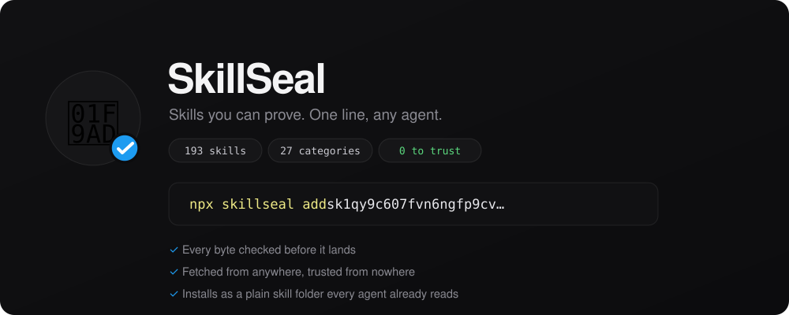

<p align="center">
  
</p>

<h1 align="center">SkillSeal 🦭</h1>
<p align="center"><b>Install agent skills you can trust. One line. Any agent.</b></p>

<p align="center">
  
  
  
  
</p>

<p align="center">
  A skill is instructions your agent loads straight into its context. SkillSeal
  turns one into a single line that proves what it is: the fingerprint of the
  contents, the publisher's key, and their signature. Paste the line and it
  checks every byte before anything is written, then installs where your agent
  already looks. No account. No registry to trust.
</p>

<p align="center">
  <a href="https://getskillseal.github.io/skillseal/hub/">Website</a> ·
  <a href="https://getskillseal.github.io/skillseal/hub/seal.html">Seal a skill</a> ·
  <a href="https://getskillseal.github.io/skillseal/docs/">Docs</a> ·
  <a href="#how-it-fits-together">How it fits together</a> ·
  <a href="#see-it-defend-an-attack">See it defend an attack</a>
</p>

## Install

```bash
npx skillseal add sk1qgq6pf8mykkwrqu2ttpynx43f57magyphegd66zrhcpfjz5mlufgaku50584ge6xhzw
```

That is the whole thing, about 60 characters. The line is the address of a
signed manifest, so it carries the skill's fingerprint, its publisher's key,
and their signature without spelling them out, and the install checks itself
before it touches disk:

```
✓ token checksum is valid          caught offline, before any download
✓ signed by 5a142b0c2d720f3d…      who published these exact contents
✓ file list matches the token      the index was not swapped
✓ all 4 files match their entries  no file was altered

  installed csv-stats → Claude Code / Claude Desktop
```

Alter one byte anywhere in the source and the install refuses, leaving nothing
on disk. Mistype one character in the line and it is rejected with no network
call. Because the fingerprint decides what is acceptable, the bytes can come
from any bucket, gateway, or mirror, and none of them have to be trusted.

Prefer a global install:

```bash
npm install -g skillseal
skillseal add sk1…
```

## Quick start

```bash
skillseal where                        # the agents found on this machine
skillseal add sk1…                     # verify a line, then install it
skillseal inspect sk1…                 # read a line, fully offline
skillseal publish ./my-skill --upload  # print the line other people paste
```

SkillSeal installs as a plain [Agent Skills](https://agentskills.io/home)
folder, so Claude Code, Claude Desktop, goose, Cursor, Codex, OpenCode,
OpenHands, Letta, Amp, Gemini CLI, and Copilot all read it with no plugin and no
integration. Browse a hub of sealed skills, each with its own line, at the
[website](https://getskillseal.github.io/skillseal/hub/) or in
[`web/hub/index.html`](web/hub/index.html).

## How it fits together

Three ideas carry the whole guarantee.

* **The line is the proof.** It packs the contents fingerprint, the publisher
  key, and an ed25519 signature into one paste. Verification happens on your
  machine, so approval is a hash rather than a name, and a changed skill is a
  different line you never approved.
* **Storage is untrusted and swappable.** The bytes live wherever is cheap: an
  S3 compatible bucket, an IPFS gateway, a plain mirror. Filecoin front doors
  like [Akave O3](https://docs.akave.xyz/) and [Filebase](https://filebase.com/)
  work by changing only the endpoint. The address is the proof, so a corrupted
  object is caught on read no matter where it came from.
* **The root of trust is content addressed.** Fingerprints and the signed audit
  root are backed by a content addressed registry that verifies every blob
  against its own hash on write and signs a deterministic root over the
  namespace.

```
   you  ──paste a line──▶  skillseal  ──fetch by address──▶  any store
                              │
                              │  checks the fingerprint, key, and signature
                              │  before a single byte is written
                              ▼
                    a plain Agent Skills folder your agent already reads
```

## Security

Approval is bound to content, not to a mutable name, so the class of attack
where a skill or a tool is swapped after you approved it becomes a different
address that is refused outright. The same guarantee covers an MCP server's tool
descriptions through a verifying gateway, and the three attacks that broke an
earlier naive design run on every build and must all stay defended. Full notes:
[docs/design/install-tokens.md](docs/design/install-tokens.md).

## See it defend an attack

```bash
git clone https://github.com/getskillseal/skillseal
cd skillseal
./demo/demo.sh
```

The demo runs a real MCP client against a real server, ships a poisoned update,
and shows the agent leak a planted secret with no protection, then blocks the
identical attack through the gateway with a printed diff. It goes on to verify a
signed fleet root, refuse a rewritten `SKILL.md`, and, when a bucket is
reachable, store a skill on decentralized storage and reject a corrupted object
on read. Every act writes machine checkable proof to `./evidence/`, so a skeptic
can validate without trusting the terminal.

Requirements: **Node 20 or newer**, and a **Rust toolchain** or **Docker** to
build the trust store on first run. Clean up with `./demo/demo.sh clean`.

## Documentation

| I want to | Start here |
| --- | --- |
| Understand the install line | [docs/design/install-tokens.md](docs/design/install-tokens.md) |
| Wire it into my agent | [docs/compatibility.md](docs/compatibility.md) |
| Encode a whole skill directory | [docs/design/encoding-hermes-skills.md](docs/design/encoding-hermes-skills.md) |
| Store skills on Filecoin | [docs/design/storage-substrate.md](docs/design/storage-substrate.md) |
| Let an agent fetch and run one | [docs/design/agent-uses-skill.md](docs/design/agent-uses-skill.md) |
| Pin and sign a whole catalogue | [docs/design/pinning-a-catalogue.md](docs/design/pinning-a-catalogue.md) |

## Development

```bash
git clone https://github.com/getskillseal/skillseal
cd skillseal
npm install
./demo/demo.sh                 # the four acts, with proof in ./evidence/
node web/hub/build-catalog.mjs   # rebuild the hub from encoded skills
cd web/site && npm start      # the docs site, generated from every SKILL.md
```

The CLI lives in [`skillseal/`](skillseal/) as a self contained package. The
web pages and docs site are static, and ship to GitHub Pages on every push to
`main`.

## Repository layout

```
skillseal/   the CLI and library — the product (npm: skillseal)
skills-ref/    sample skills, each a folder with a SKILL.md
web/
  hub/       the Sealed Skills browser (static)
  site/      the docs site (static)
docs/        design notes and assets
demo/        a runnable security demo: a verifying gateway,
             an agent that fetches and runs a sealed skill, and
             the storage layer, with proof written to demo/evidence/
```

## Built on

SkillSeal is a natural evolution of [Agent Skills](https://agentskills.io/home):
the same portable folder with a `SKILL.md`, plus a seal that proves it. It reads
and writes the format every agent already understands, so it is backward
compatible by construction. The content address and signed audit root are backed
by a content addressed registry. Thanks to Agent Skills and
[goose](https://github.com/block/goose) for the folder format.

## License

MIT
